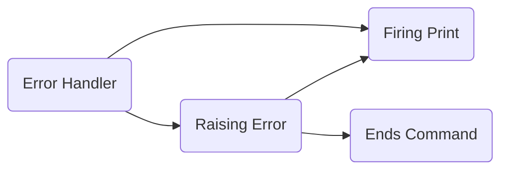

# How To Download
     
If you want to download this python CLI, then you must 
download Setup.exe from itch.io

# How To Use

If you want to use this application/CLI from python.
You must have the libraries listed in the 
ImportedLibraries.txt

  

# Errors

## No Such Attribute

The no such attribute error happens because the command is being built. If you have a specific key to access each new command or use the command named 'EnterKey' then you can access other commands that is being built.

  

## The cannot launch application

The cannot launch application (CLA Error) happens when the CLI (Command Line Interface) didn't find the application with the name that you have inputted. For example I say I want to launch hi.exe, it will say the CLA Error.

  
  

# Graph
    
## Error Handling

